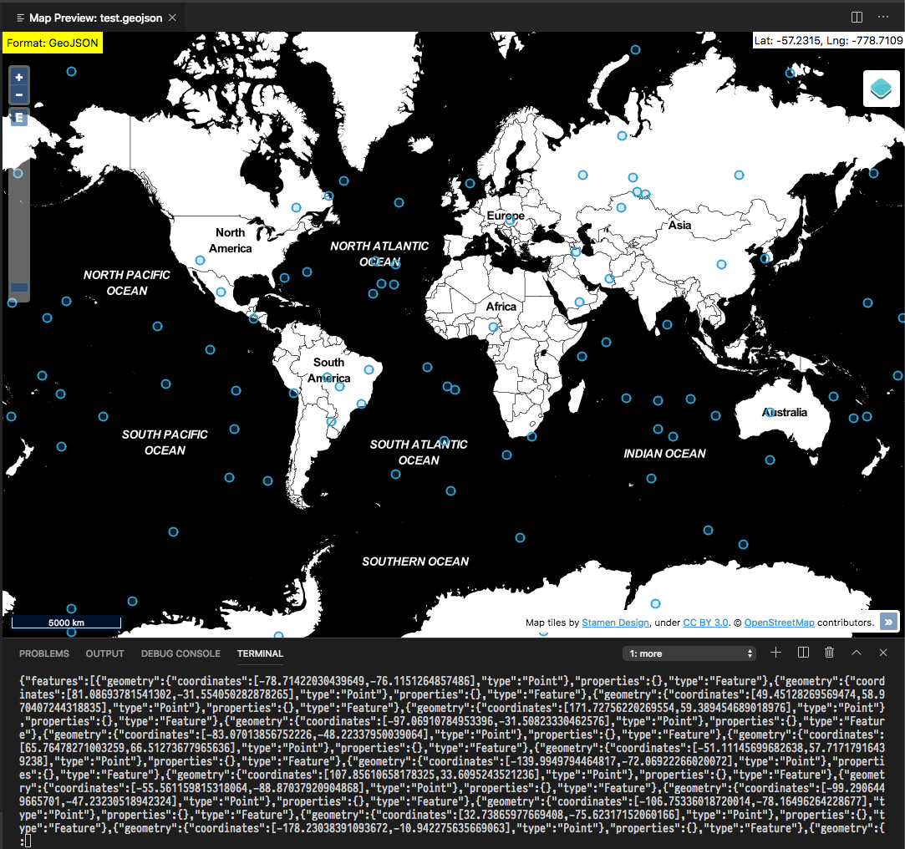

# random-geojson-points

Generate GeoJSON FeatureCollection with random Point Features.

## setup & usage

```bash
cargo install --git https://github.com/guidorice/random-geojson-points.git
random-geojson-points > test.geojson
# 100 random points are in test.geojson
```

